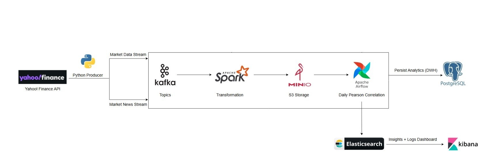
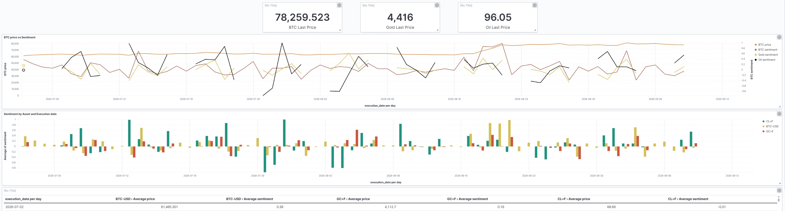
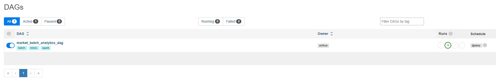
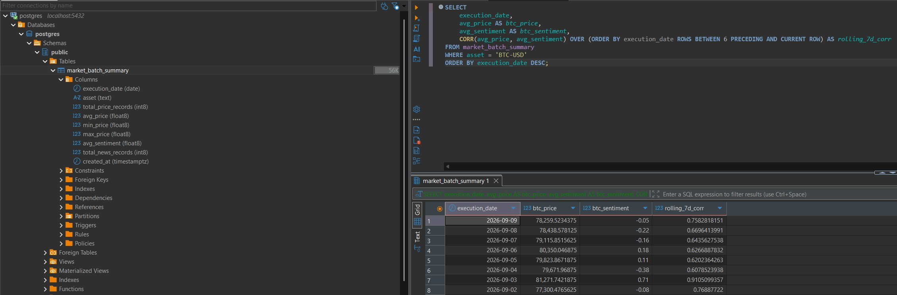

# 📈 Real-Time Market Correlations & Sentiment Analysis Pipeline

An automated, distributed Data Engineering pipeline ingesting real-time financial market quotes (Bitcoin, Gold, Oil) and news sentiment to analyze macro-market correlations using a hybrid **Data Lakehouse** and **Data Warehouse** architecture.

Developed by **Eliran Elizarov**.

---

## 📁 Repository Structure

realtime-market-analytics/
├── assets/                  # Architecture diagrams and verification screenshots
│   ├── architecture.jpg
│   ├── airflow_ui.jpg
│   ├── dwh_sql.jpg
│   └── dashboard.jpg
├── dags/                    # Apache Airflow DAG workflows
│   └── market_batch_dag.py
├── scripts/                 # Processing, ingestion, and backfill Python scripts
│   ├── Producer.py
│   ├── Spark_Streaming.py
│   ├── run_batch_analytics.py
│   ├── backfill_historical_data.py
│   └── backfill_realistic_news.py
├── docker-compose.yml       # Infrastructure container deployment config
├── presentation.pptx        # Official project presentation deck
├── requirements.txt         # Python runtime dependencies
├── .gitignore               # Git untracked files filter
└── README.md                # Main project documentation

---

## 🏗️ Architecture Overview

The pipeline ingests real-time streaming data alongside 90-day historical backfills, processes streaming NLP sentiment via Spark, persists raw layers to MinIO (S3 Object Storage), and orchestrates daily correlation batch transformations into PostgreSQL (DWH) and Elasticsearch.

### 🔄 End-to-End Data Flow:
1. **Ingestion Layer:** Custom Python Producer extracts financial quotes & news streams from Yahoo Finance API.
2. **Message Broker:** Apache Kafka buffers events into decoupled topics (`market_data_stream`, `market_news_stream`).
3. **Streaming Engine:** Apache Spark Structured Streaming computes real-time TextBlob sentiment polarity and writes Parquet to MinIO.
4. **Orchestration Layer:** Apache Airflow triggers a daily PySpark batch job (`market_batch_analytics_dag`).
5. **Multi-Model Data Sinks:**
   - **PostgreSQL (DWH):** Stores aggregated relational metrics for ad-hoc SQL window queries.
   - **Elasticsearch:** Indexes daily time-series metrics via HTTP Bulk NDJSON API.
6. **Analytics Visualization:** Kibana dashboards provide real-time dual-axis trend monitoring and cross-asset correlation matrices.

---

## 🛠️ Tech Stack & Infrastructure

| Layer | Technology | Engineering Rationale |
| :--- | :--- | :--- |
| **Ingestion** | Python & `yfinance` | Flexible, lightweight extraction of market quotes and financial news streams. |
| **Messaging** | Apache Kafka | High-throughput broker providing topic isolation and fault tolerance. |
| **Processing** | Apache Spark (PySpark) | In-memory streaming NLP transformations and distributed batch joins. |
| **Storage Lake** | MinIO | S3-compatible local object storage for raw Parquet event streaming. |
| **Orchestration** | Apache Airflow | DAG-based workflow scheduling and error retry management. |
| **Data Sinks** | PostgreSQL & Elasticsearch | Relational data warehousing (SQL) combined with time-series indexing. |
| **Visualization**| Kibana | Interactive dual-axis trend dashboards and cross-asset pivot matrices. |

---

## 📸 Proof of Concept & Visual Verification

### 1. Live Kibana Lens Analytics Dashboard
*Dual-axis price vs. sentiment line trends, grouped sentiment bars, and daily KPI metrics.*

### 2. Airflow DAG Orchestration
*Daily scheduled execution (`@daily`) managing downstream PySpark batch jobs.*

### 3. Data Warehouse & Advanced SQL Analytics
*PostgreSQL relational table executing rolling 7-day Pearson correlation window queries.*

---

## 📊 Sample Advanced SQL Query (DWH)

SELECT 
    execution_date,
    avg_price AS btc_price,
    avg_sentiment AS btc_sentiment,
    CORR(avg_price, avg_sentiment) OVER (
        ORDER BY execution_date 
        ROWS BETWEEN 6 PRECEDING AND CURRENT ROW
    ) AS rolling_7d_corr
FROM market_batch_summary
WHERE asset = 'BTC-USD'
ORDER BY execution_date DESC;

---

## 🚀 How to Run Locally

### 1. Clone the repository
git clone https://github.com/YOUR_USERNAME/realtime-market-analytics.git
cd realtime-market-analytics

### 2. Start Infrastructure Containers
docker-compose up -d

### 3. Run Historical Backfill Scripts
python scripts/backfill_historical_data.py
python scripts/backfill_realistic_news.py

### 4. Start Live Ingestion Stream
python scripts/Producer.py